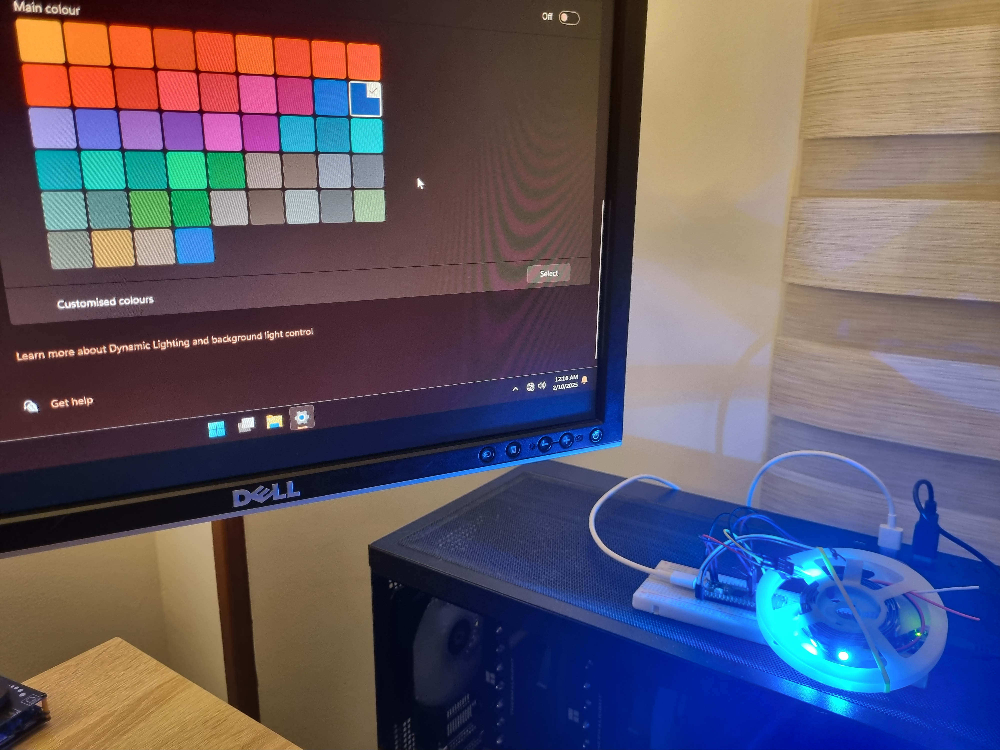

# 💡 LampArray HID for ZephyrOS

Example using [Windows Dynamic Lighting](https://learn.microsoft.com/en-us/windows-hardware/design/component-guidelines/dynamic-lighting-devices)



## Overview
This project implements a HID LampArray device for ZephyrOS, allowing control of multiple RGB LEDs through USB HID. The implementation follows the Microsoft HID LampArray Specification, enabling applications to interact with individual LEDs in an array.

## Building
An implementation for the _Raspberry Pi Pico_ board is provided. Any other board will require an **overlay** file. You can use the _rpi_pico_ one as a guideline.

For building, a **Makefile** is provided.
Setup the _Kconfig_ configuration with the following command:

```sh
make -f Makefile.rpi_pico config
```

Build the project with. Flash the generated _.uf2_ file located in `build/zephyr` into the board.

```sh
make -f Makefile.rpi_pico pristine
```

If a CMSIS debugger is attached (like pico-probe). You can flash automatically using:

```sh
make -f Makefile.rpi_pico flash
```